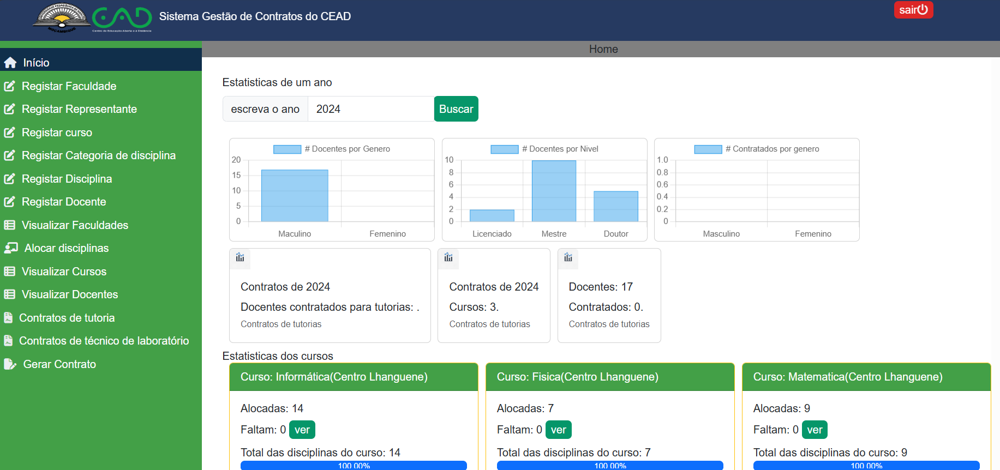
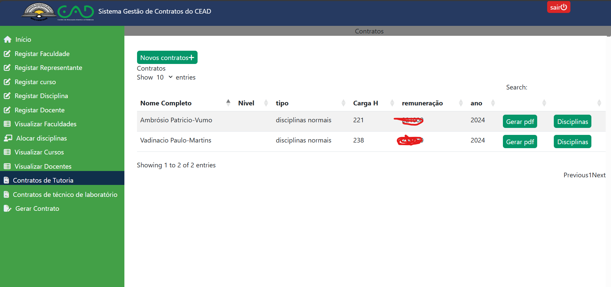
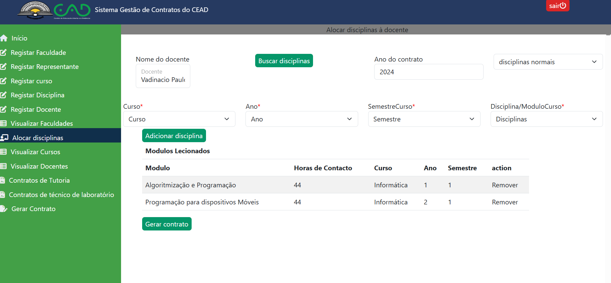

<h1>Sistema de Contratos de Tutoria do CEAD-UP Maputo</h1>

Este sistema está sendo desenvolvido como parte do meu trabalho de conclusão do Curso de Licenciatura em Informática.

O Sistema está sendo desenvolvido com o Framework Laravel. permite alocar disciplnas para vários docente em diferentes cursos e gerar contratos de forma automatica

O sistema interage também como uma API de Aprendizado de Máquina desenvolvida em python para prever as prováveis disciplinas que um docente poderá lecionar, com base em um treinamento feito

<h1>Telas Principais</h1>
<h3>1. Home</h3>
</img>
<h3>2. Visualizar Contratos</h3>

<h3>3. Alocar disciplinas</h3>

